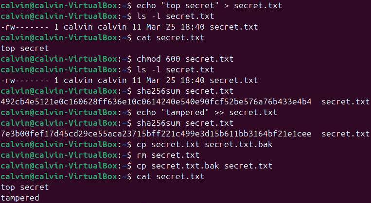

# Lab 02: CIA Triad in Ubuntu (Permissions, Hashing, Backups)

## Purpose
Demonstrate the CIA Triad using basic Linux commands:
- Confidentiality: file permissions
- Integrity: hashing
- Availability: backup and restore

## Tools
- Ubuntu VM (VirtualBox)
- Terminal

## Steps

### 1) Create a file
```bash
echo "top secret" > secret.txt
ls -l secret.txt
cat secret.txt
```

### 2) Confidentiality: restrict access
```bash
chmod 600 secret.txt
ls -l secret.txt
```

Expected result: permissions become -rw------- (only the owner can read/write).
### 3) Integrity: hash before and after change
```bash
sha256sum secret.txt
echo "tampered" >> secret.txt
sha256sum secret.txt
```
Expected result: the hash changes after the file content changes.

### 4) Availability: backup and restore
```bash
cp secret.txt secret.txt.bak
rm secret.txt
cp secret.txt.bak secret.txt
cat secret.txt
```

## What I learned
- Confidentiality can be supported with Linux file permissions (owner/group/other).
- Integrity can be verified by comparing hashes before and after changes.
- Availability can be supported through backups and restore procedures.
## Evidence
- Terminal output showing the permission change and the hash change.

