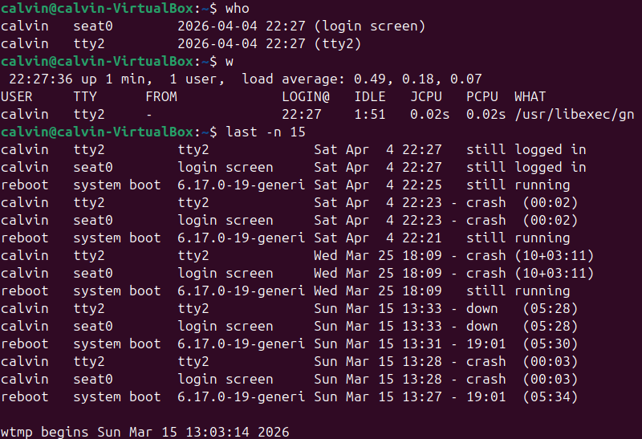
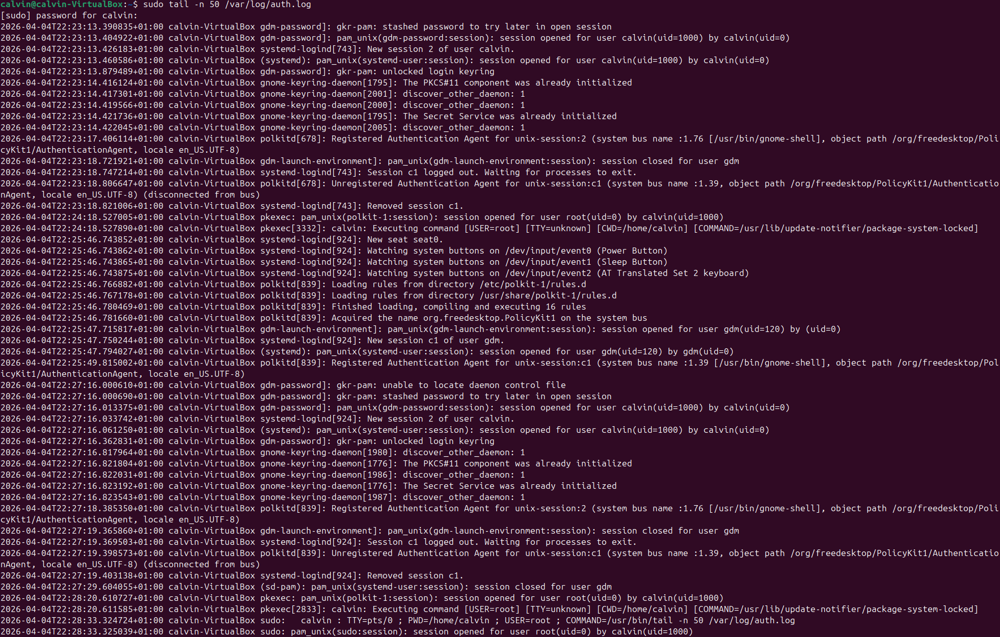

# Lab 03: Linux Authentication Logs (AAA Evidence)

## Purpose
Understand how Linux records authentication and privilege activity, and map the evidence to AAA:
- Authentication: proving identity
- Authorisation: permission and elevation checks
- Accounting: logging and audit trails

## Tools
- Ubuntu VM (VirtualBox)
- Terminal

## Commands used
```bash
who
w
last -n 15
sudo tail -n 50 /var/log/auth.log
```

## What each command shows
- `who`: current logged-in users and their sessions/terminals
- `w:` who is logged in plus what they are doing and system load
- `last -n 15`: recent login history (from wtmp)
- `/var/log/auth.log`: authentication and privilege events (PAM, sudo, polkit)

## Observations
- `who` and `w` show the active user session.
- `last` provides a timeline of logins and reboots.
- `auth.log` shows authentication events and privilege activity such as:
     - session creation via PAM
     - `sudo` session opened for root by the user
     - PolicyKit activity (`polkitd`, `pkexec`) when something runs elevated

## AAA mapping
- Authentication: PAM and login manager events
- Authorisation: polkit and sudo/privilege elevation
- Accounting: login history and auth logs that record who did what and when

## Evidence
- Terminal output screenshots:
     - 
     - 
